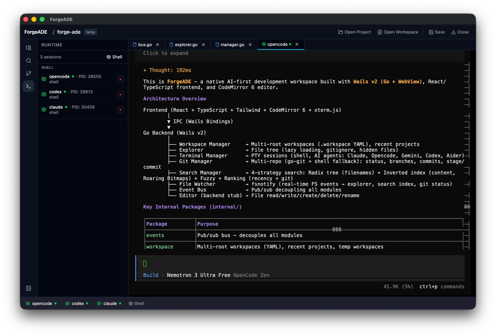
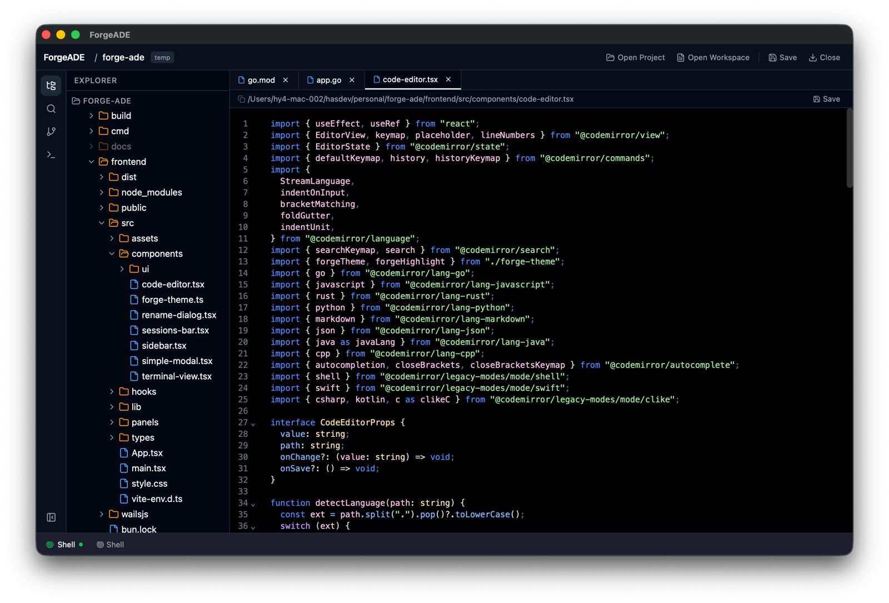

# ForgeADE

**Native AI Development Workspace**

ForgeADE is a native, lightweight, AI-first development workspace built for modern software engineers. Unlike traditional IDEs that treat AI as an extension, ForgeADE treats AI agents, terminals, Git, and projects as first-class citizens — all running locally with minimal resource usage.

Built with [Wails](https://wails.io/) (Go + WebView), React, and CodeMirror 6.

## Philosophy

- **Native First** — No Electron. Go backend, lightweight WebView frontend.
- **Workspace First** — Everything belongs to a workspace. Folders are temporary workspaces.
- **AI Native** — AI is part of the architecture, not an extension.
- **Lightweight** — Fast startup, low RAM usage.
- **Offline First** — Everything works locally. Cloud features are optional.

## Architecture

```
Frontend (React + TypeScript + Tailwind)
    │
    ▼
  IPC (Wails Bindings)
    │
    ▼
  Go Backend
    │
    ├── Workspace Manager
    ├── Session Manager (shell, AI agents, Docker, SSH…)
    ├── Git Manager
    ├── Explorer (file tree)
    ├── File Watcher (fsnotify)
    ├── Search (radix tree + inverted index + ranking)
    ├── Editor (CodeMirror 6)
    └── Event Bus (inter-module communication)
```

Every executable process is a **Session** — shell, AI agent (Claude, Opencode, Gemini CLI, Codex CLI, Aider, Kilo), Docker, SSH, or custom — all through the same PTY-based interface.

Search uses four independent strategies: instant filename lookups via a radix tree (`go-radix`), full-text content via an inverted index with Roaring Bitmaps, fuzzy VS Code–style scoring, and a ranking engine that boosts recently opened and git-modified results.

## Features

- **Multi-root workspaces** — Open multiple folders as one environment, saved as `.workspace` YAML files.
- **Terminal sessions** — Unlimited concurrent PTY tabs with resize, copy/paste, ANSI colors, and search.
- **AI agent runtime** — Launch Claude CLI, Opencode, Gemini CLI, Codex CLI, Aider, or any process as a managed session.
- **Git integration** — Stage, commit, branch management, commit history, status, and raw git commands — multi-repo aware.
- **File explorer** — Tree view with lazy loading, file create/read/write/delete/rename, hidden file toggle.
- **Code editor** — CodeMirror 6 with Go/JS/Python/Rust syntax highlighting, autocomplete, multi-cursor, code folding.
- **Instant file search** — Filename (prefix + fuzzy), full-text content (inverted index), regex, with ranking and caching.
- **File watcher** — Real-time fsnotify-based monitoring that updates the explorer, search index, and git status.
- **Event bus** — Decoupled pub/sub communication across all modules.
- **Dark theme** — macOS dark appearance, Windows Mica backdrop.

## Tech Stack

| Layer | Technology |
|---|---|
| Backend | Go 1.26, Wails v2 |
| Frontend | React 19, TypeScript, Tailwind CSS 4 |
| Editor | CodeMirror 6 |
| Terminal | xterm.js + `creack/pty` |
| Git | `go-git/v5` + shell fallback |
| Search | `armon/go-radix`, `RoaringBitmap/roaring` |
| File watching | `fsnotify` |
| Workspace files | YAML |
| Build | Vite 7, Bun |

## Features

### Shell + AI Agents
Sessions managed as first-class citizens — shell terminals and AI agents (Claude, Opencode, Kilo) share the same runtime interface with start/stop/rename.



### Code Editor
Syntax highlighting for Go, TypeScript, JavaScript, Rust, Python, Markdown, JSON, Java, C, C++, C#, Kotlin, Swift, and Shell. CodeMirror 6 with line numbers, bracket matching, code folding, search panel (Cmd+F), and auto-indentation.



## Getting Started

### Prerequisites

- Go 1.26+
- Node.js / Bun
- [Wails CLI](https://wails.io/docs/gettingstarted/installation)

### Development

```bash
wails dev
```

This starts the Vite dev server with hot reload for the frontend and the Go backend in live mode.

### Build

```bash
wails build
```

Produces a native distributable binary in `build/bin/`.

## Project Structure

```
├── internal/
│   ├── events/       — Pub/sub event bus
│   ├── explorer/     — File tree browsing
│   ├── git/          — Multi-repo Git operations
│   ├── search/       — Filename + content indexing
│   ├── terminal/     — PTY session manager (shell, AI agents)
│   ├── watcher/      — fsnotify file watcher
│   └── workspace/    — Workspace lifecycle & settings
├── frontend/
│   └── src/          — React UI (panels, components, hooks)
├── cmd/              — CLI entry points
├── pkg/              — Shared utilities
├── docs/             — Architecture docs
├── app.go            — Wails app bindings
└── main.go           — Application entry point
```

## Design Docs

Detailed architecture decisions are documented in `docs/`:

- [Product Requirements](./docs/prd.md)
- [Search Architecture](./docs/search-architecture.md)
- [Terminal Architecture](./docs/terminal-architecture.md)

## License

MIT
